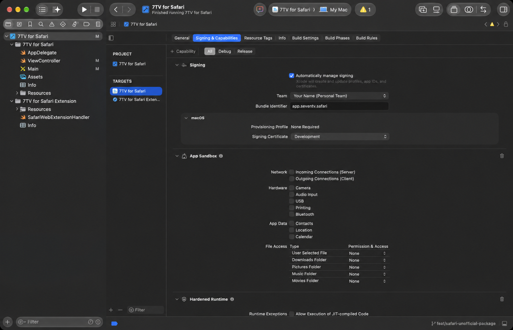
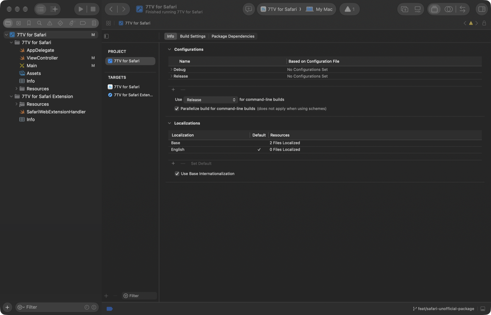
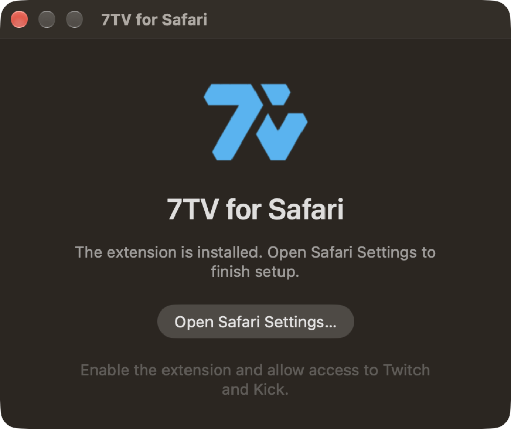

# 🖱️ Manual installation

[← Back to the package overview](README.md) · [Use commands instead →](INSTALL-COMMANDS.md)


This route uses only Xcode and Finder. No Terminal commands are required.

> [!IMPORTANT]
> This is an **unofficial Safari build of the real 7TV Web Extension**. You are
> not installing a separate emote service. Xcode packages the included 7TV
> resources into the native container Safari requires and signs it with your
> own free Apple Development identity.

## ✅ Before you begin

-   macOS 12 or later.
-   The full [Xcode app](https://apps.apple.com/app/xcode/id497799835).
-   A free Apple Account.

> [!WARNING]
> Xcode Command Line Tools alone are not sufficient. You need the full Xcode
> app from the Mac App Store.

## 1. Prepare Xcode

1. Install and open Xcode once.
2. Accept Apple's license and allow Xcode to finish its first-launch setup.
3. Open **Xcode > Settings > Accounts** and add your Apple Account.
4. Select the account, choose **Manage Certificates**, press **+**, and create
   an **Apple Development** certificate if none exists.

> [!NOTE]
> The certificate stays in your macOS Keychain. This package never uploads or
> exports it.

## 2. Open the Safari project

Open this file from the extracted package:

```text
7TV for Safari/7TV for Safari.xcodeproj
```

In Xcode, select the blue **7TV for Safari** project. Under **Signing &
Capabilities**, choose your **Personal Team** for both targets:

-   **7TV for Safari**
-   **7TV for Safari Extension**



> [!TIP]
> Your Personal Team name will be different from the generic name shown in the
> screenshot. That is expected.

## 3. Build and run

At the top of Xcode:

1. Select the **7TV for Safari** scheme.
2. Select **My Mac** as the destination.
3. Press the ▶ **Run** button.



Wait for the containing app to appear. It must show the 7TV icon, an extension
status, and the **Open Safari Settings…** button.



> [!CAUTION]
> If the app opens as a blank window, stop here. That is not the expected build;
> review the troubleshooting section below before enabling anything in Safari.

## 4. Enable the extension

1. Press **Open Safari Settings…**. The containing app closes automatically.
2. Safari opens directly at **Settings > Extensions**.
3. Enable **7TV for Safari (Unofficial)**.
4. Allow access to **Twitch** and **Kick**.
5. If macOS asks whether the app may control Safari, choose **Allow**. This
   permission is restricted to opening Safari's Extensions Settings panel.

## 5. Reload Twitch or Kick once

> [!TIP]
> If Safari shows the extension as enabled and its icon is blue, but the 7TV
> button or emotes are missing on a tab that was already open, **reload the page
> once**. Safari injects a newly enabled extension when the page loads.


## 6. Verify the result

-   [ ] Open a Twitch stream and confirm that 7TV emotes render.
-   [ ] Reload Twitch and confirm that 7TV returns.
-   [ ] Open Kick and repeat the same check.
-   [ ] Quit Safari completely, reopen it, and confirm the extension still loads.

## 🛠️ Troubleshooting

<details>
<summary><strong>Xcode says the bundle identifier is unavailable</strong></summary>

Change both identifiers under **Signing & Capabilities** to a unique prefix:

```text
local.yourname.seventv.safari
local.yourname.seventv.safari.Extension
```

Keep `.Extension` on the extension target and use the same prefix for both.

</details>

<details>
<summary><strong>No Apple Development certificate appears</strong></summary>

Return to **Xcode > Settings > Accounts > Manage Certificates**, press **+**,
and create an **Apple Development** certificate. Then select the Personal Team
again for both targets.

</details>

<details>
<summary><strong>The extension is enabled, but nothing appears on Twitch</strong></summary>

Reload the Twitch tab once. If it still does not appear, confirm that Safari
granted website access to `twitch.tv`, then quit and reopen Safari.

</details>

## 🧹 Remove it later

Use the recoverable procedure in [UNINSTALL.md](UNINSTALL.md).
