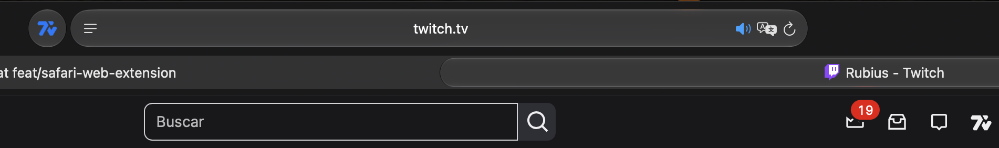

# 7TV for Safari

### Use the real 7TV Web Extension on Safari

> [!IMPORTANT]
> This is an **independent, unofficial Safari build**. It is not published,
> signed, supported, or endorsed by 7TV. It is based directly on the real
> [7TV Web Extension](https://github.com/SevenTV/Extension), with the native
> wrapper and compatibility changes Safari requires. It is not a replacement
> emote system and does not imitate or proxy 7TV.

## 📣 Help bring Safari support upstream

An initial proposal was published as
**[SevenTV/Extension#1265](https://github.com/SevenTV/Extension/pull/1265)** and
then closed by this fork's maintainer before official review. A revised upstream
PR is planned. When it is ready, this section will link to the active proposal
so interested users can review it and show support constructively.

> [!NOTE]
> Until Safari support is accepted upstream, I intend to keep this self-build
> package updated in the fork, provided the official 7TV team has no objection.
> It will remain clearly marked as unofficial. Please do not spam or pressure
> upstream maintainers while the revised proposal is being prepared.

### Why the official team is still needed

This fork can keep the source compatible with Safari and provide a reproducible
self-build package. A normal one-click download, comparable to installing a
regular browser extension, additionally needs:

-   A 7TV-owned Apple Developer identity.
-   Official signing and Apple notarization.
-   Trusted release downloads maintained by 7TV.
-   An official update and support policy.

Only the 7TV team can make that distribution an **official 7TV release**. Until
then, the local Xcode build is the transparent installation path available from
this fork.

## ✨ What you get

-   The familiar 7TV experience on **Twitch** and **Kick** in Safari.
-   The same extension resources and 7TV services used by the upstream project.
-   A local macOS app that lets Safari discover and manage the extension.
-   A reproducible build signed by **your own Apple Development certificate**.
-   No paid installer, browser switch, Node.js, Homebrew, or Git requirement.

## 🚀 Choose an installation method

| Method                                         | Best for                                            | What you do                                                       |
| ---------------------------------------------- | --------------------------------------------------- | ----------------------------------------------------------------- |
| [🖱️ Manual installation](INSTALL-MANUAL.md)    | People who prefer a visual guide                    | Open the project in Xcode and press Run                           |
| [⌨️ Command installation](INSTALL-COMMANDS.md) | The shortest repeatable setup                       | Run two included commands                                         |
| 🤖 AI-assisted installation                    | People using Codex, Claude, or another coding agent | Ask it to follow `INSTALL-COMMANDS.md` and run every verification |

### Requirements

-   macOS 12 or later.
-   The free [Xcode app from the Mac App Store](https://apps.apple.com/app/xcode/id497799835).
-   A free Apple Account added in **Xcode > Settings > Accounts**.

> [!NOTE]
> Full Xcode is required only to build and sign the Safari app. The package
> already contains the compiled web extension, so Node.js, Yarn, Homebrew, Git,
> and the standalone Command Line Tools package are not required.

## 🧩 How it works

| Stage                      | What happens                                                                                                                   |
| -------------------------- | ------------------------------------------------------------------------------------------------------------------------------ |
| **1. 7TV runtime**         | The package contains the actual compiled 7TV Web Extension resources.                                                          |
| **2. Safari container**    | Xcode builds a small native macOS app containing those resources as a Safari Web Extension.                                    |
| **3. Local signing**       | The app and extension are signed locally with your Apple Development identity. Your certificate is never uploaded or exported. |
| **4. Safari registration** | The app is installed in `~/Applications`, Safari discovers it, and you enable it from **Safari > Settings > Extensions**.      |
| **5. Page injection**      | Safari loads 7TV only on the sites declared by the extension: Twitch, Kick, and YouTube.                                       |

The containing app does not need to stay open. Its job is to install the Safari
extension and open the correct Settings panel; it closes automatically after
that panel opens.

## 🔐 Permissions and trust

| Permission                               | Why it exists                                                                                                  |
| ---------------------------------------- | -------------------------------------------------------------------------------------------------------------- |
| `storage`                                | Saves 7TV settings locally in the browser.                                                                     |
| Twitch, Kick, and YouTube website access | Lets 7TV render emotes and integrate its controls on supported pages.                                          |
| Restricted Safari automation             | Opens Safari's **Extensions** Settings panel when you press the setup button. It is not general UI automation. |

The included verifier checks the signature, bundle names, exact site list,
manifest permissions, Safari registration, and the restricted Settings-panel
entitlement. Optional broad permissions are rejected.

## 🔄 First launch: reload the page once

> [!TIP]
> If the extension is enabled and its Safari icon is blue, but the 7TV button
> or emotes do not appear on a Twitch or Kick tab that was already open,
> **reload that page once**. Safari injects a newly enabled extension when the
> page loads.

## ♻️ Updates and free signing

Keep **7TV for Safari.app** in `~/Applications`; removing it also removes the
extension from Safari. A free Personal Team signature may need to be renewed
periodically. If Safari stops accepting it, run the same installation again.
The installer verifies the replacement first and keeps the previous app as a
non-runnable backup.

## 🧹 Uninstall

Follow [UNINSTALL.md](UNINSTALL.md) to remove every local app copy, Xcode build,
and Safari registration. The uninstaller moves matching files to the Trash so
they remain recoverable.

## ⚖️ Project status and license

This package is maintained independently while official Safari distribution is
not available. The 7TV source and bundled license remain under **Apache 2.0 +
Commons Clause**; see the
[7TV license](https://github.com/SevenTV/Extension/blob/master/LICENSE.md).
7TV names and trademarks belong to their respective owners.
